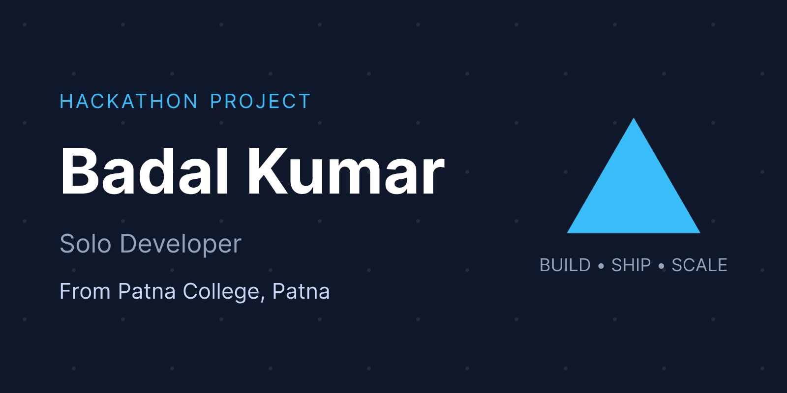

<div align="center">
  
  <br />
  
</div>

# CollabOne — Federated Multi-College Platform

<div align="center">
  <!-- Technologies -->
  
  
  
  
  
  
  
  <br />
  <!-- Techniques -->
  
  
  
  
  
</div>

<br />

**collabOne** is a Federated Multi-College Platform with a modular monolith architecture. It is built as a complete Node.js/Express backend, heavily featuring multi-tenant isolation via subdomains and row-level database security.

> **Status:** Backend Complete, Frontend Complete
> **Base URL:** `http://localhost:8000` (Local)
> **Architecture:** Modular Monolith | Multi-tenant via subdomain + row-level isolation

---

## 🚀 Features

- **Federated Architecture & Multi-Tenancy**: Subdomain-based tenant routing (e.g., `projects.a.localhost`). Cryptographically secure inter-tenant isolation with cross-tenant project collaboration.
- **Matchmaking Engine**: Matches students with required projects using Jaccard Similarity Algorithm (70% skill overlap + 30% normalised reputation score) cached in Redis for fast access.
- **Reputation Ecosystem**: Users rate each other after collaborations. Reputation and scores are dynamically calculated using synchronous recalculations.
- **Project Workspaces**: Users can create tenant-scoped projects, post necessary skill sets, and set member limits. Includes cross-college capabilities allowing users from multiple tenants to collaborate!
- **Unified Messages**: Integrated team communication module limited directly to approved project members.
- **Robust Authentication**: Three-layer trust chain authentication: Subdomain -> DB Lookup -> College-Key Header validation -> `collegeId` validation across requests. Passwords hashed using Argon2id.

---

## 🛠️ Technology Stack

- **Runtime**: Bun / Node.js
- **Framework**: Express.js
- **Database**: PostgreSQL (via Neon) with Drizzle ORM
- **Caching & Ranking computation**: Redis (ioredis wrapper, with graceful fallback handling)
- **Authentication**: JWT (Stateless Authentication Model)
- **Validation**: Zod (End-to-End type safety middleware mapping)

---

## 📋 Local Development Setup

### 1. Prerequisites

- Bun installed (`curl -fsSL https://bun.sh/install | bash` or via installer for Windows)
- PostgreSQL database (or Neon Data credentials)
- Redis instance (optional: Docker is recommended, but backend explicitly defaults gracefully without it)

### 2. Environment Configuration

Copy the `.env.example` file to `.env`:

```bash
cp .env.example .env
```

Ensure you have set `DATABASE_URL` appropriately inside the `.env` file.

### 3. Tenant Routing Setup (Localhost)

In Development (`DOMAIN_SUFFIX=localhost`), we need to route traffic into corresponding subdomains using the local `hosts` file.

**For Windows (Run PowerShell as Administrator):**

```powershell
Add-Content "C:\Windows\System32\drivers\etc\hosts" "127.0.0.1   projects.a.localhost"
Add-Content "C:\Windows\System32\drivers\etc\hosts" "127.0.0.1   projects.b.localhost"
```

**For Unix (Linux/macOS):**

```bash
echo "127.0.0.1   projects.a.localhost" | sudo tee -a /etc/hosts
echo "127.0.0.1   projects.b.localhost" | sudo tee -a /etc/hosts
```

### 4. Database Setup & Seed

Install packages, push the Drizzle schemas automatically and seed the two mock colleges (`College A` and `College B`).

```bash
bun install
bun run db:push
bun run db:seed
```

### 5. Start Development Server

```bash
bun run dev
```

Starts gracefully with Pino logger enabled at `http://localhost:8000`.

---

## 🔐 Authentication & Domain Isolation Model

The architecture enforces tenant rules using a Host header mapping and unique college IDs cross-checked against a cryptographic DB header value (`X-College-Key`).

In production the URLs will shift to `projects.a.ac.in`, but locally we operate with `projects.a.localhost`.

### Demo Accounts Seeded

| Role                  | Email                       | Password              | Required Host Header   |
| --------------------- | --------------------------- | --------------------- | ---------------------- |
| **Super Admin**       | `superadmin@platform.ac.in` | `SuperSecurePass123!` | Not required           |
| **Alice (College A)** | `alice@a.ac.in`             | `Pass1234!`           | `projects.a.localhost` |
| **Bob (College A)**   | `bob@a.ac.in`               | `Pass1234!`           | `projects.a.localhost` |
| **Dave (College B)**  | `dave@b.ac.in`              | `Pass1234!`           | `projects.b.localhost` |

### Platform Keys

When making requests, you must include the `Host` Header as well as an `X-College-Key` for tenant verification logic.

| College       | Domain                 | API Key (`X-College-Key`)                     |
| ------------- | ---------------------- | --------------------------------------------- |
| **College A** | `projects.a.localhost` | `cc_live_collegea000000000000000000000000000` |
| **College B** | `projects.b.localhost` | `cc_live_collegeb000000000000000000000000000` |

---

## 💻 Frontend Ecosystem

The platform features a multi-faceted frontend ecosystem designed for both technical demonstration and user interaction. The frontend applications are located in the `frontend` directory:

### 1. `one-collab` (Main Application)

The primary user-facing interface built with **Next.js**. It features a modern app-router architecture, robust tenant-aware authentication, and fully integrated views for matchmaking, messaging, and project collaboration.

### 2. `api-test-ui` (API Playground)

A lightweight, vanilla HTML/JS web interface built specifically to interact with and test the backend APIs. It includes quick-login buttons for seeded users and a live request/response inspection pane to demonstrate tenant isolation in real-time.

### 3. `project-showcase` (Interactive Presentation)

An interactive presentation deck built with HTML/CSS showcasing the platform's architecture. It contains architectural diagrams, database ERDs, algorithms breakdown, and a link to the generated Swagger OpenAPI documentation.

---

## 📖 API Documentation & Links

Detailed API documentation with all request bodies, responses, pagination formats and route architecture can be found here:
👉 **[`/docs/api.md`](./docs/api.md)**

Modules implemented:

1. `/api/v1/onboarding` - Platform Onboarding Requests
2. `/api/v1/admin` - Platform Administration
3. `/api/v1/auth` - Tenant Authentication Layer (Stateless JWT)
4. `/api/v1/users` - User State & Skills Management (Jaccard Eviction triggers)
5. `/api/v1/projects` - Cross-College & Local Workspaces
6. `/api/v1/match` - Matchmaker Results
7. `/api/v1/reputation` - Peer review scores calculations
8. `/api/v1/messages` - Secure Project Channels

Check out the _Context Log_ for developer decisions and architectural insights here:
👉 **[`/docs/context.md`](./docs/context.md)**

---

_Built for CIMAGE 2026 Hackathon 🏆_
